# Notfallpunkt

__ACHTUNG: Dieses Projekt befindet sich noch in Entwicklung, noch nicht alles funktioniert vollständig (insbesondere die Website)__

Dieses Projekt wurde inspiriert von der [Notfallbox](https://deutschland-funkt.de/notfallbox/doku.php?id=start) des
Bürgernotfunk-Projekts [Deutschland funkt !!!](https://deutschland-funkt.de/)

Analog dazu ist dies ebenfalls für einen Raspberry Pi vorgesehen, spezifisch ebenfalls einen Raspberry Pi Zero (2) (W),
allerdings mit den folgenden Unterschieden:

* Verwendet [Docker](https://www.docker.com/), damit potenziell auf deutlich mehr Hardware nutzbar und erheblich vereinfachte Installation
* Eigens entwickelte Software ebenfalls auf Basis von PHP, aber mit den folgenden Unterschieden:
    * Basiert auf PHP 8.2, NGINX
    * Verwendet Templates zur einfachen Anpassbarkeit unter Verwendung von [Twig](https://twig.symfony.com/)
    * Verwendet [Composer](https://getcomposer.org/) zur Installation von Abhängigkeiten
    * Verwendet [Bootstrap 5](https://getbootstrap.com/docs/5.0/getting-started/introduction/),
      [jQuery 3.7.1](https://blog.jquery.com/2023/08/28/jquery-3-7-1-released-reliable-table-row-dimensions/),
      [Google Fonts](https://fonts.google.com/), 
      [Font Awesome 4.7.0](https://fontawesome.com/v4/icons/)
    * Optimiert auf Performance (lokales Caching, Minification, Cache-Header, GZip usw.)

## Funktionsweise
Dieses Projekt erstellt nach Einrichtung des Systems einen WLAN-AccessPoint basierend auf einem extern angeschlossenen
USB-WLAN-Stick (`wlan1` Adapter) mit dem Namen `notfallpunkt`. Sobald ein Nutzer eine Verbindung mit dem WLAN herstellt,
wird er (bzw. sollte er je nach Handy) automatisch auf die Startseite des Notfallpunkts weitergeleitet werden,
ansonsten ist der Aufruf mittels `http://10.3.9.1/` im Browser möglich.

**ACHTUNG: Das System erwartet einen angeschlossenen USB-WLAN-Stick! Um stattdessen den eingebauten WLAN-
Adapter zu verwenden, ist in der Datei `.env` entsprechend `wlan1` durch `wlan0` zu ersetzen!**

Das WLAN ist generell unverschlüsselt, damit jeder dies nutzen kann, ohne dass zuvor ein Passwort bekannt gemacht werden
muss. Das bedeutet auch, dass potenziell jeder mit entsprechendem Wissen sämtliche Kommunikation mitlesen kann.

Daher besteht zusätzlich die Option, per HTTPS (also mit Verschlüsselung) zuzugreifen. Hierbei ist es natürlich nicht
möglich, ein offizielles HTTPS-Zertifikat zu verwenden, da diese lediglich für Hostnamen und nicht für IP-Adressen
ausgestellt werden, daher erhält naturgemäß jeder Nutzer, der https://10.3.9.1/ anstelle von http://10.3.9.1/ aufruft,
einen entsprechenden Warnhinweis, der ignoriert werden kann, da die Verbindung natürlich weiterhin sicher verschlüsselt
ist.

### Installation
1. Raspberry Pi Imager herunterladen von https://www.raspberrypi.com/software/, installieren und starten

2. Dort als _Raspberry Pi Gerät_ `Raspberry Pi Zero  2W` oder `Raspberry Pi Zero` je nach Gerät auswählen

. 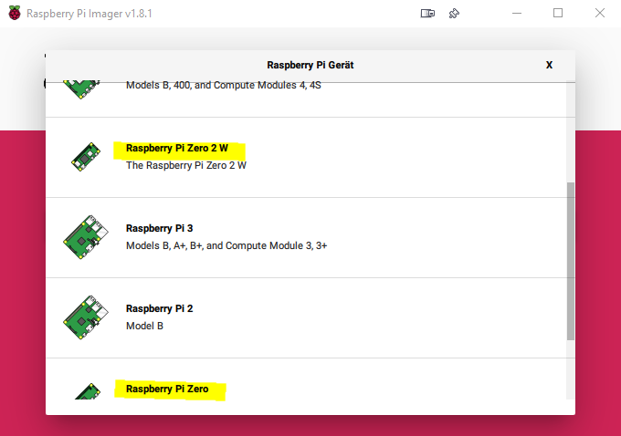

3. Als Betriebssystem `Raspberry Pi OS (Legacy) Lite` auswählen oder analoges, jedenfalls ohne Desktop

  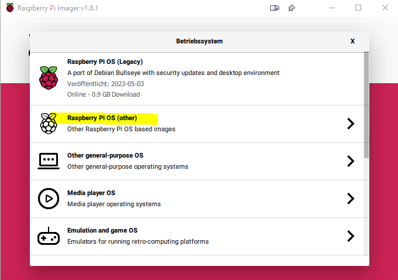

  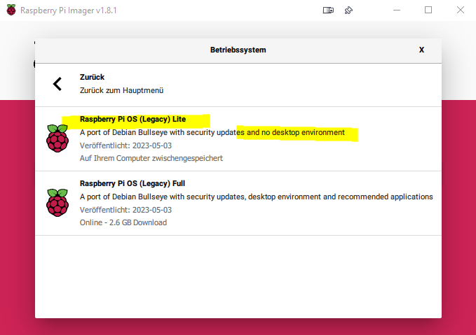

4. Die entsprechende SD-Karte am Computer anschließen mit passendem Lesegerät und dann auswählen

  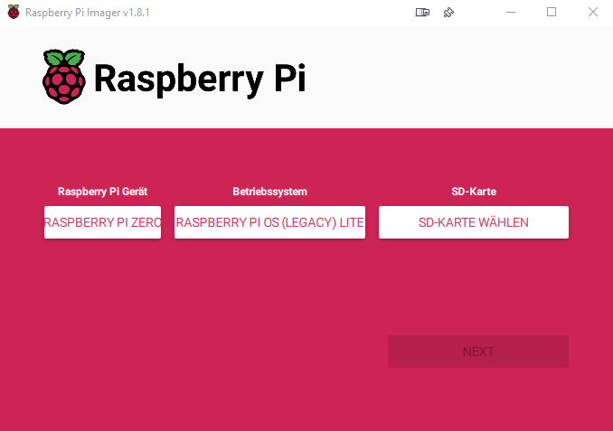

5. Dann auf _Next_ klicken und dann auf _Einstellungen bearbeiten_

  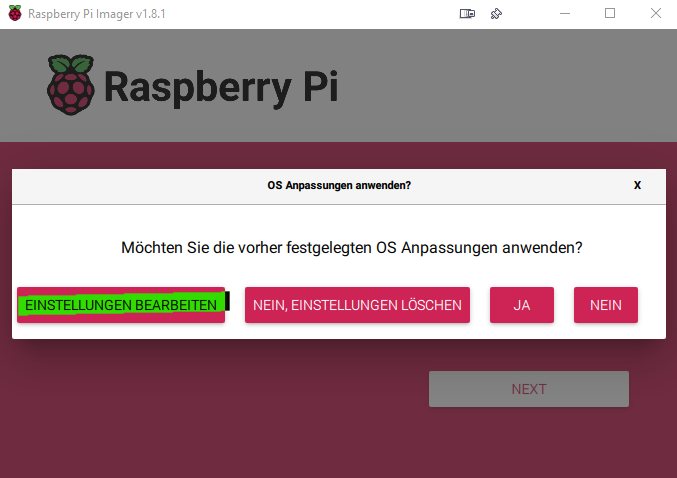

6. Dort die Optionen wie folgt konfigurieren (Benutzername und Passwort beliebig, aber sicher!)

  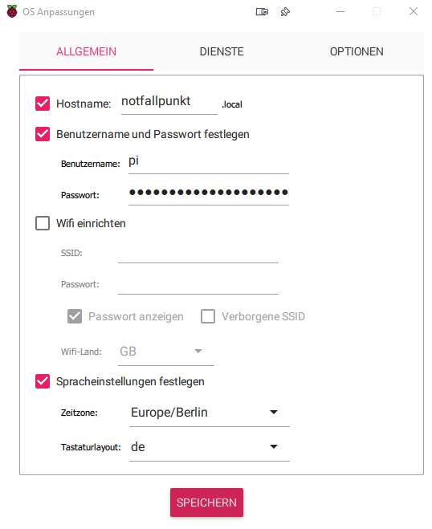

7. Unter _Dienste_ SSH aktivieren

  

8. Unter _Optionen_ wie folgt konfigurieren oder ganz nach Wunsch

  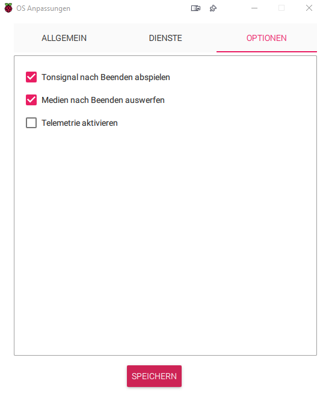

9. SD-Karte schreiben, auswerfen und in Raspberry Pi einlegen und starten, optional Tastatur und
  Bildschirm anschließen

10. [PuTTY](https://www.chiark.greenend.org.uk/~sgtatham/putty/latest.html) herunterladen, installieren und starten

11. `notfallpunkt` eintragen und _ENTER_ drücken

  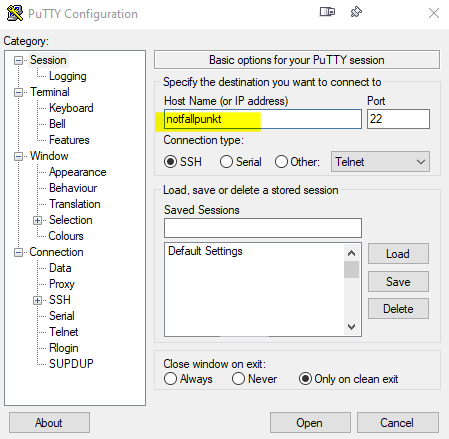

12. Den SSH-Key bestätigen

  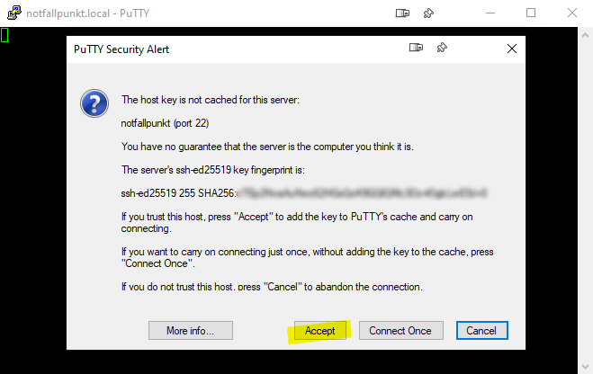

13. Mit Benutzername und Passwort einloggen (oder automatisch wie unter #7. mit vorher gewählten SSH-Key),
   jedoch als normaler Nutzer und nicht als _root_ (auch nicht mit `sudo`!)

  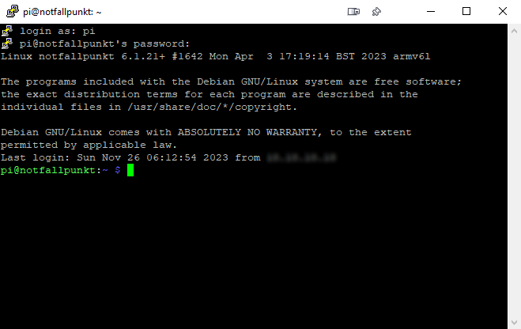

14. Die folgenden Befehle der Reihe nach ausführen:
```
cd /opt
sudo -s
apt install git -y
git clone https://github.com/blackoutland/notfallpunkt.git
cd notfallpunkt
exit
./setup-system.sh
```
im Anschluss zweimal hintereinander mittels `exit` ausloggen und erneut wie unter
  #11. beschrieben neu einloggen (Punkt #12. entfällt automatisch)

15. Die Inhalte ganz nach Wunsch installieren (jeweils `j/n` eintippen), indem der folgende
 Befehl ausgeführt wird:
  `./setup-files.sh`

  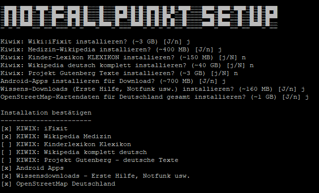

16. Nunmehr können die Docker-Container gebaut und automatisch gestartet werden:

`docker-compose up --build`

Dies kann länger dauern, da ein _Raspberry Pi Zero_ nicht so leistungsfähig ist und beim
ersten Aufruf die Container erst gebaut und dazu auch Code compiliert werden muss.
Ab dem zweiten Start wird dies erheblich schneller sein, da die Container ja nur einmal
gebaut werden müssen. Auch wenn es so aussieht, als würde länger nichts geschehen bitte nicht
abbrechen und weiter arbeiten lassen, bis alle Container Informationen wie diese anzeigen:

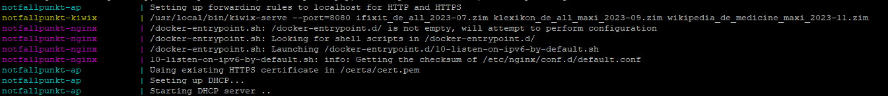

Damit wurden die Container gebaut und automatisch gestartet. Zum Stoppen einfach `Strg+C` drücken.

## Start/Stop des Systems
Zukünftig werden die Container bei jedem Systemstart automatisch neu gestartet.
Um diese zur Laufzeit zu stoppen wie folgt vorgehen:

```
cd /opt/notfallpunkt
docker-compose down
```

Zum (Neu)starten der Container:
```
cd /opt/notfallpunkt
docker-compose up -d
```

Durch das "-d" laufen diese im Hintergrund. Zur Analyse von Fehler am besten ohne diesen
Parameter starten - denn werden alle Fehler direkt auf der Konsole angezeigt!
Mit `Strg+C` können die Container dann wieder gestoppt werden.

## Informationen zum System
In der Datei `.env` werden die entsprechenden Netzwerkparameter (für Experten)
konfiguriert - normalerweise muss man hier nichts ändern.
Nach der Verbindungsherstellung per WLAN kann über http://10.3.9.1/ direkt auf die
Oberfläche zugegriffen werden! Normalerweise sollte diese Seite aber automatisch aufgerufen
werden bei Verbindungsherstellung mit dem WLAN.


